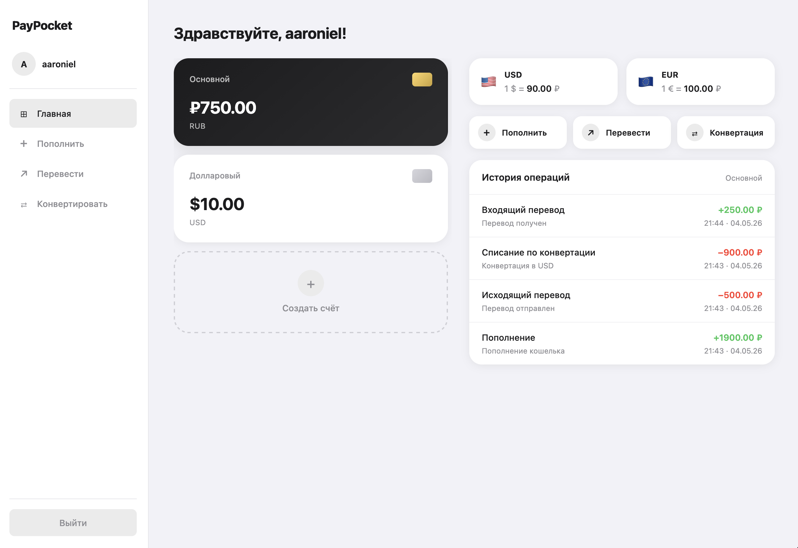

# 💳 PayPocket — Digital Wallet

Сервис электронного кошелька: регистрация, создание кошельков,
пополнение, снятие, переводы между пользователями,
конвертация валют и просмотр истории операций.

> Учебный проект, разработанный в рамках подготовки
> к стажировке на позицию Backend Java-разработчик.

---



---

## Функциональность

- **Регистрация и авторизация** — создание аккаунта с проверкой уникальности username и email, вход с паролем
- **Ролевая модель безопасности** — роли USER и ADMIN. Обычные пользователи работают только со своими данными; администратор видит всех пользователей, их кошельки и все транзакции системы. Роль зашита в JWT и проверяется на эндпоинтах `/api/v1/admin/**`
- **Мультивалютные кошельки** — создание кошельков в RUB, USD, EUR (один кошелёк на валюту)
- **Пополнение и снятие средств** — внесение и вывод средств с валидацией суммы (до 2 знаков после запятой)
- **Переводы** — перевод средств другому пользователю по username с проверкой валют, достаточности средств и подтверждением операции
- **Конвертация валют** — обмен между кошельками одного пользователя по текущему курсу с расчётом эквивалента и сохранением деталей операции
- **Атомарные транзакции** — переводы и конвертации выполняются через @Transactional с блокировкой строк (@Lock PESSIMISTIC_WRITE)
- **История операций** — постраничный просмотр транзакций с датой, типом и суммой
- **Веб-интерфейс** — дашборд, формы пополнения, перевода и конвертации, история в браузере
- **REST API** — полноценный API с валидацией, обработкой ошибок и Swagger-документацией
- **Юнит-тесты** — JUnit 5 + Mockito для бизнес-логики UserService и WalletService

---

## Стек технологий

| Технология        | Назначение                              |
|-------------------|-----------------------------------------|
| Java 17           | Язык разработки                         |
| Spring Boot 3.3   | Фреймворк, автоконфигурация             |
| Spring Data JPA   | ORM, репозитории без реализации         |
| Spring MVC        | Веб-интерфейс (Thymeleaf)               |
| Hibernate         | JPA-реализация, dirty checking          |
| PostgreSQL        | Реляционная база данных                 |
| HikariCP          | Пул соединений (авто)                   |
| Flyway            | Автоматические миграции БД              |
| Swagger/OpenAPI   | Документация REST API                   |
| JUnit 5 + Mockito | Юнит-тесты сервисного слоя              |
| Gradle            | Система сборки                          |
| SLF4J             | Логирование                             |

---

## Архитектура

Слоистая архитектура (Layered Architecture) с разделением ответственности:

```
┌─────────────────────────────────┐
│  Web UI (Thymeleaf Controllers) │  HTML-страницы в браузере
│  REST API (RestControllers)     │  JSON-ответы для клиентов
├─────────────────────────────────┤
│  Service (UserService,          │  Бизнес-логика, валидация,
│           WalletService,        │  @Transactional
│           ExchangeRateService)  │
├─────────────────────────────────┤
│  Repository (Spring Data JPA)   │  Интерфейсы без реализации
├─────────────────────────────────┤
│  Hibernate + PostgreSQL         │  ORM, SQL-генерация, пул соединений
└─────────────────────────────────┘
```

---

## Структура проекта

```
paypocket/
├── build.gradle
├── settings.gradle
├── Dockerfile
├── docker-compose.yml
├── README.md
└── src/
    ├── main/
    │   ├── java/com/paypocket/
    │   │   ├── PayPocketApplication.java          — @SpringBootApplication
    │   │   ├── model/                             — JPA Entity
    │   │   │   ├── User.java
    │   │   │   ├── Wallet.java
    │   │   │   ├── Transaction.java
    │   │   │   ├── TransactionType.java
    │   │   │   └── Currency.java
    │   │   ├── repository/                        — Spring Data JPA
    │   │   │   ├── UserRepository.java
    │   │   │   ├── WalletRepository.java
    │   │   │   └── TransactionRepository.java
    │   │   ├── service/                           — бизнес-логика
    │   │   │   ├── UserService.java
    │   │   │   ├── WalletService.java
    │   │   │   └── ExchangeRateService.java
    │   │   ├── controller/                        — веб-интерфейс (Thymeleaf)
    │   │   │   ├── AuthController.java
    │   │   │   ├── WalletController.java
    │   │   │   └── api/                           — REST API
    │   │   │       ├── UserApiController.java
    │   │   │       ├── WalletApiController.java
    │   │   │       └── GlobalExceptionHandler.java
    │   │   ├── config/                            — конфигурация
    │   │   │   └── OpenApiConfig.java
    │   │   ├── dto/                               — запросы и ответы API
    │   │   │   ├── CreateUserRequest.java
    │   │   │   ├── LoginRequest.java
    │   │   │   ├── CreateWalletRequest.java
    │   │   │   ├── DepositRequest.java
    │   │   │   ├── TransferRequest.java
    │   │   │   ├── TransferResult.java
    │   │   │   ├── ConvertRequest.java
    │   │   │   ├── ConversionResult.java
    │   │   │   ├── UserResponse.java
    │   │   │   ├── WalletResponse.java
    │   │   │   ├── TransactionResponse.java
    │   │   │   └── ErrorResponse.java
    │   │   └── exception/                         — типизированные исключения
    │   │       ├── PayPocketException.java
    │   │       ├── UserNotFoundException.java
    │   │       ├── DuplicateUserException.java
    │   │       ├── WalletNotFoundException.java
    │   │       ├── WalletAlreadyExistsException.java
    │   │       ├── WalletOwnershipException.java
    │   │       ├── InsufficientFundsException.java
    │   │       ├── SelfTransferException.java
    │   │       ├── InvalidAmountException.java
    │   │       └── CurrencyMismatchException.java
    │   └── resources/
    │       ├── application.yml                    — конфигурация Spring Boot
    │       ├── templates/                         — HTML-шаблоны Thymeleaf
    │       │   ├── login.html
    │       │   ├── register.html
    │       │   ├── dashboard.html
    │       │   ├── deposit.html
    │       │   ├── transfer.html
    │       │   ├── convert.html
    │       │   ├── wallet-new.html
    │       │   └── history.html
    │       ├── static/css/
    │       │   └── style.css
    │       └── db/migration/
    │           └── V1__create_tables.sql          — Flyway-миграция
    └── test/java/com/paypocket/
        └── service/                               — юнит-тесты (JUnit 5 + Mockito)
            ├── UserServiceTest.java
            └── WalletServiceTest.java
```

---

## Как запустить

### Вариант 1: Docker Compose (рекомендуется)

```bash
git clone https://github.com/semenov-timur/paypocket.git
cd paypocket
docker-compose up --build -d
```

### Вариант 2: Локальная разработка

Требования: Java 17+, PostgreSQL

```bash
git clone https://github.com/semenov-timur/paypocket.git
cd paypocket

# Запустить БД в контейнере или локально
docker-compose up -d db # запуск в контейнере
# или локально: psql -U postgres -c "CREATE DATABASE paypocket;"

# Запустить приложение
./gradlew bootRun
```

### Доступ

| Интерфейс      | URL                                   |
|----------------|---------------------------------------|
| Веб-приложение | http://localhost:8080                 |
| REST API       | http://localhost:8080/api/v1/...      |
| Swagger UI     | http://localhost:8080/swagger-ui.html |

---

## REST API

Интерактивная документация: http://localhost:8080/swagger-ui.html

| Метод | URL                               | Описание                             |
|-------|-----------------------------------|--------------------------------------|
| POST  | /api/v1/users                     | Регистрация пользователя             |
| POST  | /api/v1/users/login               | Авторизация пользователя             |
| GET   | /api/v1/users/{id}                | Получить пользователя                |
| POST  | /api/v1/wallets?userId=...        | Создать кошелёк                      |
| GET   | /api/v1/wallets?userId=...        | Кошельки пользователя                |
| GET   | /api/v1/wallets/{id}              | Информация о кошельке                |
| POST  | /api/v1/wallets/{id}/deposit      | Пополнение                           |
| POST  | /api/v1/wallets/{id}/transfer     | Перевод средств другому пользователю |
| POST  | /api/v1/wallets/{id}/convert      | Конвертация между своими кошельками  |
| GET   | /api/v1/wallets/{id}/transactions | История операций                     |

### Эндпоинты администратора (только роль ADMIN)

Доступ к `/api/v1/admin/**` требует JWT пользователя с ролью `ADMIN` —
иначе сервер отвечает `403 Forbidden`.

| Метод | URL                          | Описание                                |
|-------|------------------------------|-----------------------------------------|
| GET   | /api/v1/admin/users          | Все пользователи вместе с их кошельками  |
| GET   | /api/v1/admin/wallets        | Все кошельки системы                     |
| GET   | /api/v1/admin/transactions   | Все транзакции системы (постранично)     |

Администратор создаётся автоматически Flyway-миграцией `V2`:
`username: admin`, пароль: `admin1234` (BCrypt-хэш в миграции).
**Смените пароль администратора перед использованием в реальной среде.**

---

## Тестирование

Юнит-тесты сервисного слоя на JUnit 5 + Mockito. Репозитории и
вспомогательные сервисы мокируются — тесты не зависят от БД и Spring-контекста.

- **UserServiceTest** — регистрация, проверка уникальности, аутентификация
- **WalletServiceTest** — создание кошельков, пополнение, перевод, конвертация валют, обработка ошибок (недостаточно средств, разные валюты, перевод самому себе, чужой кошелёк, нулевой результат конвертации и т.д.)

```bash
./gradlew test                                              # все тесты
./gradlew test --tests "com.paypocket.service.WalletServiceTest"  # один класс
```

---

## Ключевые технические решения

**BigDecimal для денег** — `double` не может точно
представить десятичные дроби (0.1 + 0.2 ≠ 0.3 в IEEE 754).
В финансовых приложениях используется BigDecimal для точной арифметики.

**Двойная запись (double-entry)** — каждый перевод и конвертация
создают две записи транзакций: TRANSFER_OUT/CONVERT_OUT у источника
и TRANSFER_IN/CONVERT_IN у получателя. Банковский стандарт,
обеспечивающий сверяемость данных.

**Атомарность переводов и конвертаций** — @Transactional с @Lock(PESSIMISTIC_WRITE).
Блокировки упорядочены по UUID для предотвращения deadlock.
При любой ошибке — автоматический ROLLBACK.

**Конвертация валют** — отдельный ExchangeRateService инкапсулирует
получение курсов и расчёт суммы (внутренняя точность курса 8 знаков,
итоговая сумма округляется до 2 знаков по HALF_UP). Текущая реализация
использует захардкоженные курсы; публичный API позволяет заменить
её на интеграцию с внешним провайдером без изменений в WalletService.

**Dirty Checking** — Hibernate отслеживает изменения managed-объектов
внутри @Transactional и автоматически генерирует UPDATE при commit.

**Spring Data JPA** — репозитории без реализации. Spring генерирует
SQL по имени метода (findByUsernameIgnoreCase → SELECT ... WHERE LOWER(username) = LOWER(?)).

**Глобальная обработка ошибок** — @RestControllerAdvice перехватывает
исключения и возвращает структурированный JSON с HTTP-статусом
(404, 409, 403, 400) вместо 500 со стектрейсом.

**Паттерны проектирования:**
- Builder — создание Transaction (много полей, часть опциональна)
- Strategy — интерфейс Repository с взаимозаменяемыми реализациями
- Dependency Injection — Spring управляет зависимостями через конструкторы
- MVC — разделение контроллеров, сервисов и представлений
- DTO — разделение внутренних Entity и внешнего API

---

## Эволюция проекта

Проект прошёл через четыре этапа, каждый доступен через Git-теги:

| Версия | Стек                                          | Описание                                                     |
|--------|-----------------------------------------------|--------------------------------------------------------------|
| v1.0   | Java, InMemory, JSON                          | Консольное приложение, хранение в памяти и файле             |
| v2.0   | JDBC, PostgreSQL, HikariCP                    | Реальная БД, атомарные транзакции, SELECT FOR UPDATE         |
| v3.0   | Spring Boot, JPA, Thymeleaf, REST             | Веб-интерфейс, REST API, Swagger, Flyway                     |
| v4.0   | Конвертация валют, Docker Compose, юнит-тесты | Конвертация валют, контейнеризация приложения, JUnit/Mockito |

```bash
# Посмотреть конкретную версию
git checkout v1.0
git checkout v2.0
git checkout v3.0
git checkout v4.0
```

---

## Планы развития

- [x] Консольное приложение на чистой Java (InMemory)
- [x] Мультивалютные кошельки
- [x] PostgreSQL + JDBC + HikariCP
- [x] Атомарные транзакции с SELECT FOR UPDATE
- [x] Логирование (SLF4J)
- [x] Spring Boot + Spring Data JPA
- [x] Веб-интерфейс (Thymeleaf)
- [x] REST API + Swagger/OpenAPI
- [x] Flyway миграции
- [x] Глобальная обработка ошибок
- [x] DTO с валидацией (Jakarta Validation)
- [x] Docker-контейнер для приложения
- [x] Юнит-тесты (JUnit 5 + Mockito)
- [x] Конвертация валют
- [x] JWT-аутентификация для REST API
- [x] Ролевая модель безопасности (USER / ADMIN)

---

## Автор: Семенов Тимур

Разработано в рамках подготовки к стажировке
Backend Java-разработчик.